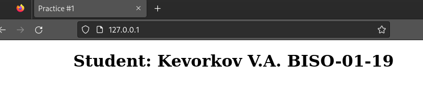
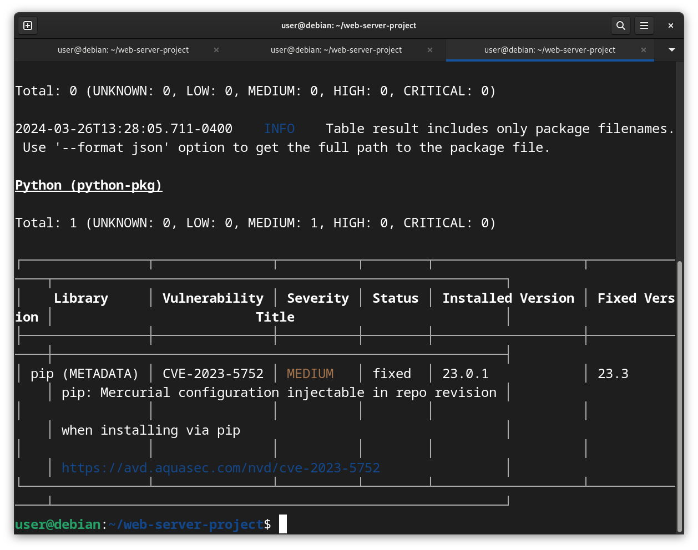
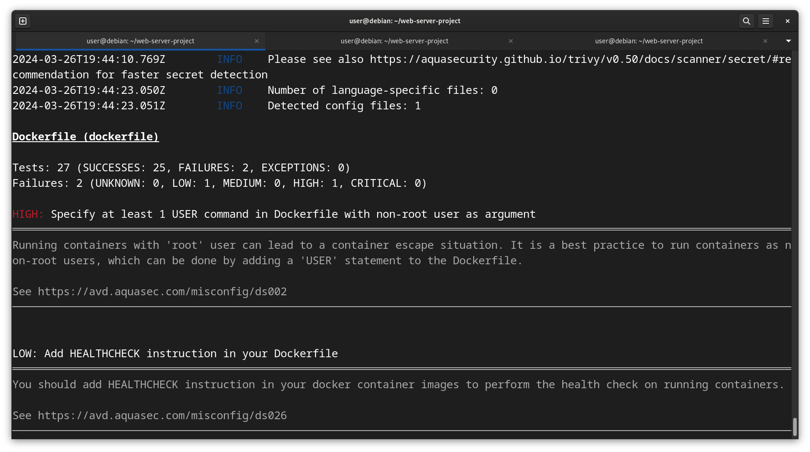

# Приложение состоит из 3 контейнеров:

- Flask (wsgi - gunicorn)  
- Nginx (proxy)  
- Redis (persistent DB)

# 1. Результат работы

# 2. Сканирование Trivy

В результате сканирования образа контейнера Flask была найдена уязвимость CVE-2023-5752. Уязвимость связана с возможным изменением конфигурации репозитория Mercurial при его установке через pip (pip install 'hg+https://...'). Как следует из описания уязвимости на [сайте NVD](https://nvd.nist.gov/vuln/detail/CVE-2023-5752), она не затрагивает пользователей, которые не используют установку из Mercurial.  

В результате сканирования изнутри контейнера Flask была найдена high-уязвимость типа [Misconfiguration](https://avd.aquasec.com/misconfig/ds002). Уязвимость заключается в том, что контейнер запускается под root'ом. В Dockerfile рекомендуется создавать отдельного пользователя, от имени которого будет запускаться контейнер.

В остальных образах и контейнерах уязвимостей не обнаружено.
